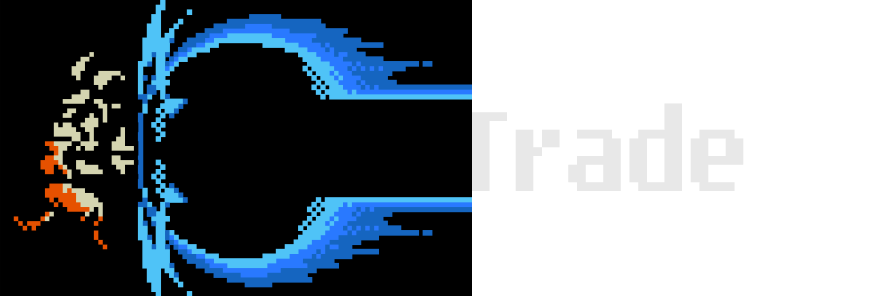

# KameTrade



# Web application is written in React in conjunction with TypeScript (still under development)

## If you want to try it out here is a link: [KameTrade](https://kame-trade.vercel.app/), but keep in mind that it is under continous developlment!

## Why was it created in the first place?

I have wanted to learn more about cryptocurrencies, and stocks. It was designed to help me simulate investment with the current prices of certain assets. Simultaneously, I was finishing my main learning path to learn TypeScript and React, so I thought it would be a great idea to master already gained knowledge in React and Typescript in a noncommercial project.

## Project Overview 📝

This app shows most of the available cryptocurrencies and stocks. It is possible to search through them in the table which allows you to sort them by name, price, change, volume, and market capitalization. Directly from the table, you can get information about the chosen asset, and obtain brief information about the asset. The asset information page also allows users to see how the price changed in selected periods of time on a simple line "range" chart or candle stick chart. If the user would register to KameTrade it unlocks the ability to make a simulation of a purchase of that asset. After registration user will be having dedicated profile "wallet" of purchased assets in which it will be possible to see how bought assets behave in time.

## Installation :minidisc:

Login and registration won't work because API key and API URL are in ENV file, which shouldn't be included to public repository. That's why only after the project will be live it will be possible.

1. Clone the repository and open the project in yours IDE.

2. Open the terminal and change directory to "KameTrade"

3. Install all necessary packages, entering that line in terminal:

```
npm install
```

4. Next step is to run the project in development mode, typing:

```
npm run dev
```

## Technological stack used in project

| Technology                                                            | Description                                                                                                         |
| --------------------------------------------------------------------- | ------------------------------------------------------------------------------------------------------------------- |
| [React](https://react.dev/)                                           | Powerful library to build User Interfaces                                                                           |
| [TypeScript](https://www.typescriptlang.org/)                         | Main language used to manage logic in app                                                                           |
| [ChakraUI](https://chakra-ui.com/)                                    | UI component library which provides blocks to build React applications                                              |
| [Axios](https://axios-http.com/docs/intro)                            | Axios is a library that allows conducting asynchronous operations in a more simplified way                          |
| [TanStack Query & Table](https://tanstack.com/)                       | TanStack Query makes fetching, caching, and updating of web app piece of cake                                       |
| [React Router DOM](https://reactrouter.com/en/main)                   | Library to create routing in SPA application                                                                        |
| [React Hook Form](https://react-hook-form.com/)                       | React Hook Form provides a performant, extensible way to create forms along with a simple way to validate forms     |
| [yup](https://github.com/jquense/yup)                                 | Small library to manage form validation in object schema                                                            |
| [Lightweight Charts](https://www.tradingview.com/lightweight-charts/) | Chart library maintained by TradingView, it provides ability to create financial charts including candlestick chart |
| [ChartJS](https://www.chartjs.org/)                                   | Simple JavaScript chart library                                                                                     |

## Project Preview

Comming soon!

# Project isn't finished (yet - I'm currently working on it)

**What's left?**

-   Investment simulator, in which user can deposit "fake digital money", and purchase any available asset.
-   User profile "wallet" which will contain a table with the user assets, a chart displaying how assets behaved in time.
-   Add more responsiveness.
-   Make it live!
